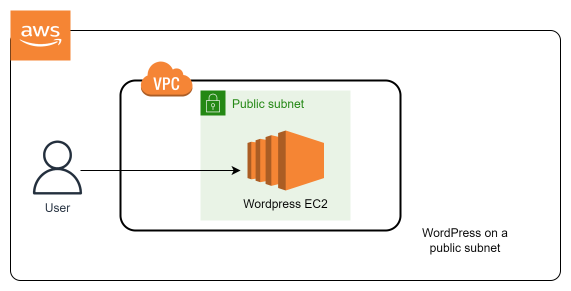

# Installing-wordpress-to-aws-ec2
How to Install WordPress on AWS EC2  
 
Hi everyone! I have a tutorial on Medium which will guide you through the process of installing WordPress on your AWS EC2 Instance/Server. There are various ways to set up WordPress. It can be done using the AWS console just as you would see in this tutorial, or CLI. You can also migrate an existing WordPress website from another host or server to AWS. However i'm taking the easiest route by using the console on AWS EC2 to perform a secure installation from Bitnami. Bitnami is a library/software package that provides WordPress on AWS.
To read more on this tutorial follow this link: How to Install WordPress on AWS EC2</a>   <a href="https://medium.com/@t.unamka/how-to-install-wordpress-on-aws-ec2-b807a6632c17">How to Install WordPress on AWS EC2</a>
